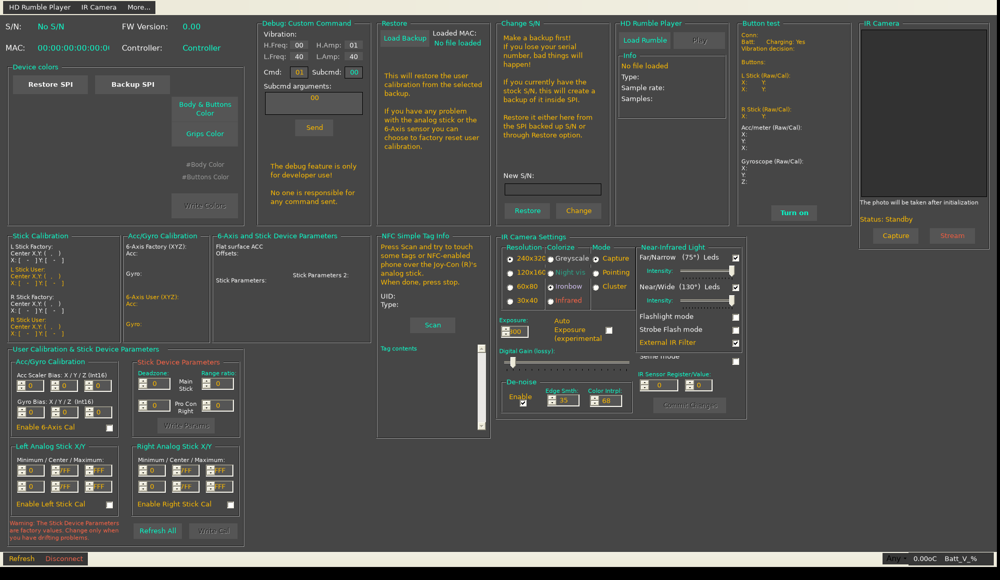

# Porting Joy-Con Toolkit to Linux

> **Status:** Route A below (C# on Mono) is done. The full app lives in
> [`linux/mono/src`](../linux/mono/src). To build, test and use it, follow
> [`linux/README.md`](../linux/README.md). This document is kept as the design
> notes behind the port and as a guide for Route B (Python + Kivy).

This guide takes Joy-Con Toolkit from a Windows-only C++/CLI app to a native
Linux app with the same features. It covers two routes:

- **Route A — C# on Mono (done).** Keep WinForms, reuse the existing
  C# color picker unchanged, and convert the rest of the code.
- **Route B — Python + Kivy.** A full rewrite with a new UI.

Both routes share the Linux setup in [Part 1](#part-1--linux-setup-both-routes).

Starter code lives in [`linux/`](../linux):

| Path | What it is | Status |
|---|---|---|
| `linux/udev/50-nintendo-switch-controllers.rules` | Lets your user open the controllers without root | Ready to install |
| `linux/mono/HidApi.cs` | P/Invoke binding to `libhidapi-hidraw` for every hidapi call jctool uses | Builds on Mono 6.8 |
| `linux/mono/JoyCon.cs`, `JcProbe.cs` | C# port of the connection logic, device info, SPI read/write, S/N | Builds on Mono 6.8; not yet tested with a controller |
| `linux/mono/tools/cppcli_designer_to_cs.py` | Converts FormJoy.h's WinForms designer code to C# | Generates `linux/mono/src/FormJoy.Designer.cs` |
| `linux/mono/src/` | The complete port | Builds and passes `--selftest`; see `linux/README.md` |
| `linux/python/jcprobe.py` | Python version of `jcprobe` for Route B | Runs; not yet tested with a controller |
| `linux/python/extract_resx_images.py` | Pulls the controller/battery images out of the `.resx` files as PNGs | Tested: 23 PNGs + icon |

---

## Why the existing project can't just be built with Mono

`jctool` is a **C++/CLI mixed-mode** program (`<CLRSupport>true</CLRSupport>` in
`jctool.vs2017.vcxproj`): FormJoy.h is managed WinForms code, and jctool.cpp is
native C++ that calls into it through `FormJoy::myform1`. Mono can't compile
C++/CLI or load mixed-mode assemblies, and MSVC's `/clr` only targets
Windows. So jctool has to be **translated** either way. What varies is how much
survives:

| Component | Lines | Route A (C#/Mono) | Route B (Python/Kivy) |
|---|---:|---|---|
| `jc_colorpicker/` (C#) | ~6,000 | **Reused as is.** Builds with `xbuild` on Mono with 0 errors | Rewrite (Kivy `ColorPicker` + preset buttons) |
| FormJoy.h designer code | ~3,800 | **Auto-converted** by the script | Rewrite as `.kv` layouts |
| FormJoy.h logic (event handlers, image recoloring) | ~2,700 | Hand-port, near line by line | Rewrite |
| jctool.cpp protocol code | ~3,200 | Hand-port, near line by line (C# keeps `goto`, `unsafe`) | Rewrite with `struct.pack_into` |
| `tune.h`, `luts.h`, `ir_sensor.h` tables | ~1,000 | Paste into `static readonly` arrays | Paste into lists |
| `images.resx`, `FormJoy.resx` | — | Compile with `resgen` as is | Extract to PNG files |

**Recommendation:** use Route A if you want "functionally identical" soonest.
Use Route B if you'd rather have a modern Python codebase (and possibly
Android/touch later) and accept a longer rewrite. Mono's WinForms is feature
complete but frozen: Mono is in maintenance (now hosted by WineHQ), and .NET
8+ WinForms does not run on Linux.



*FormJoy's designer layout converted by `cppcli_designer_to_cs.py`,
compiled with `mcs`, and running on Mono 6.8 under Linux. This is the design
time layout with every panel visible; the constructor's `reset_window_option()`
hides and moves them at run time. The merged features are there: IR Mode group
(Capture/Pointing/Cluster), controller priority drop-down (bottom right), NFC
tag contents box.*

---

## Part 1 — Linux setup (both routes)

### 1.1 Packages

```sh
# Debian/Ubuntu
sudo apt install libhidapi-hidraw0 bluez
# Route A
sudo apt install mono-devel libgdiplus          # or mono-complete
# Route B
python3 -m venv ~/.venvs/jctool && . ~/.venvs/jctool/bin/activate
pip install hidapi kivy pillow numpy
```

Fedora: `hidapi bluez mono-devel libgdiplus`. Arch: `hidapi bluez mono` (AUR
may be needed for `libgdiplus`).

### 1.2 Pair the controller (Bluetooth)

The Windows toolkit only uses Bluetooth, so start there.

```sh
bluetoothctl
  power on
  scan on            # hold the sync button on the controller until the lights run
  pair XX:XX:XX:XX:XX:XX
  trust XX:XX:XX:XX:XX:XX
  connect XX:XX:XX:XX:XX:XX
```

A `/dev/hidrawN` node appears when it connects.

### 1.3 Permissions (udev)

```sh
sudo cp linux/udev/50-nintendo-switch-controllers.rules /etc/udev/rules.d/
sudo udevadm control --reload-rules && sudo udevadm trigger
```

Reconnect the controller. `ls -l /dev/hidraw*` should now show an ACL `+` for
your user. Third-party controllers with other IDs need an extra line (the
rules file explains how).

### 1.4 The kernel's `hid-nintendo` driver and `joycond`

Linux 5.16+ has `hid_nintendo`, which binds to Joy-Con and Pro Controllers and
sends its own subcommands (input mode 0x30, player LEDs, IMU, rumble). hidraw
still gets a copy of every report, but the driver and the toolkit are then
both talking to the controller. The toolkit switches to input modes 0x3F/0x31
for SPI, IR and NFC, which can confuse the driver, and vice versa. If replies
time out, the IR or NFC stream stalls, or the controller disconnects:

```sh
sudo systemctl stop joycond        # if installed
sudo modprobe -r hid_nintendo      # then reconnect the controller
```

`hid-generic` then binds the controller and `/dev/hidrawN` still appears. Run
`sudo modprobe hid_nintendo` afterwards to get normal gamepad input back.
Test with the driver loaded first; unloading it is the fallback.

### 1.5 USB (optional; not in the Windows app)

The Windows app is Bluetooth-only (the USB code in `Main()` is commented out).
Over USB, a Pro Controller or charging grip needs the handshake from
[HID-Joy-Con-Whispering](https://github.com/shinyquagsire23/HID-Joy-Con-Whispering)
(`hidtest/hidtest.cpp`, `joycon_init()`) before it accepts `0x01` subcommand
reports:

| Report | Meaning |
|---|---|
| `80 01` | Get MAC (reply `81 01 ...`; `buf[2] == 3` means nothing connected) |
| `80 02` | Handshake |
| `80 03` | Switch to 3 Mbit baud rate |
| `80 02` | Handshake again at the new baud rate |
| `80 04` | HID only from now on (no USB timeout) |
| `80 05` | Allow USB timeout again (send before closing) |

The charging grip (`057e:200e`) exposes two HID interfaces: interface 0 is the
right Joy-Con and interface 1 is the left, so open both with `hid_open_path()`.
Whispering's `uinputdriver` shows the same loop in C, with udev and uinput.
Leave USB until Bluetooth works end to end.

### 1.6 Linux vs Windows hidapi differences to keep in mind

| Area | Windows (jctool today) | Linux hidraw |
|---|---|---|
| Library | Vendored `jctool/hid.c` (Windows backend, with `-d` traffic logging) | System `libhidapi-hidraw.so.0`. Move traffic logging into your wrapper (`HidApi.cs`) |
| `wchar_t` strings | 2 bytes (UTF-16) | **4 bytes (UTF-32).** `HidApi.cs` decodes them by hand |
| Bluetooth manufacturer string | `"Nintendo"` | **Empty.** hidraw only knows the Bluetooth name, so the pseudo-third-party check must accept `""` (both probes do) |
| Writes | Padded to the report length | Sent exactly as passed. jctool writes 49 bytes (fine); the NFC code writes 48 (`output_buffer_length - 1`), so check NFC early |
| `hid_read_timeout(h, buf, 0, 64)` | Drops one queued report | Same on hidraw (the report is consumed) |
| `Sleep(ms)` | Win32 | `Thread.Sleep(ms)` / `time.sleep(ms / 1000)` |
| Python binding | — | `pip install hidapi` → **`import hidraw`**. Its `import hid` module uses the libusb backend, which can't see Bluetooth controllers. The separate `pip install hid` (ctypes) package loads the system hidraw library but also installs a module named `hid`, so install only one of the two |

---

## Part 2 — Route A: C# on Mono

### Step A1 — Milestone 1: talk to the controller

```sh
cd linux/mono
make                 # builds jcprobe.exe
mono jcprobe.exe -l  # list HID devices (same output as jctool -l)
mono jcprobe.exe     # connect and print type, FW, MAC, S/N, colors
mono jcprobe.exe -p pro
```

Compare the output with what the Windows toolkit shows for the same
controller. If this works, the transport, permissions and packet layout are
right, and everything after this is translation.

### Step A2 — Milestone 2: the form on Mono

```sh
make regen           # re-generates src/FormJoy.Designer.cs (and src/Tables.cs) from the C++ sources
```

`tools/cppcli_designer_to_cs.py` writes to `linux/mono/build/regen/`:

- `FormJoy.Designer.cs` — the 211 control fields and `InitializeComponent()`.
  Don't edit it; change FormJoy.h and re-run the script, or stop generating it
  once you drop the C++ version.
- `FormJoy.Handlers.cs` — 45 stubs for the event handlers the designer wires up,
  with the right `EventArgs` types. Each stub only prints `Not ported yet: <name>`,
  so the form runs while you port one handler at a time.

Resources are compiled from the original `.resx` files by `resgen`, with the
logical names the code expects (`CppWinFormJoy.FormJoy.resources`,
`CppWinFormJoy.images.resources`).

### Step A3 — Project layout for the port

```
linux/mono/
  HidApi.cs                  (done) hidapi P/Invoke (+ add -d traffic logging here)
  JoyCon.cs                  (started) jctool.cpp: connection, SPI, device info
  JoyCon.Rumble.cs           send_rumble, play_tune, play_hd_rumble_file (+ tune.h)
  JoyCon.ButtonTest.cs       button_test, AnalogStickCalc
  JoyCon.Ir.cs               ir_sensor, get_raw_ir_image, auto exposure, drawCluster (+ ir_sensor.h)
  JoyCon.Nfc.cs              nfc_tag_info
  JoyCon.Misc.cs             battery, temperature, dump_spi, custom command, LEDs
  Luts.cs                    luts.h (mcu_crc8_table etc.)
  FormJoy.cs                 FormJoy.h: constructor, class variables, all functions
  Overrides.cs               Overrides.h (dark theme renderer/color table)
  Program.cs                 Main(): -l, -d, -f and the connection retry loop
  build/FormJoy.Designer.cs  generated
../../jctool/jc_colorpicker/ reference jcColor.dll built from the existing csproj
```

Build the color picker with `xbuild` (or `msbuild`) and reference it:

```sh
xbuild /p:Configuration=Release /p:OutputPath=$PWD/linux/mono/build/ \
    jctool/jc_colorpicker/jcColorDialog.vs2017.csproj
mcs ... -r:linux/mono/build/jcColor.dll
```

Once you have more than a few files, switch the Makefile to an SDK-style
`.csproj` targeting `net472` and build it with Mono's `msbuild`.

### Step A4 — Translating jctool.cpp (native C++ → C#)

jctool.cpp is procedural code over byte buffers, so it maps almost one to one.

| C++ in jctool.cpp | C# |
|---|---|
| `u8 buf[49]; memset(buf, 0, sizeof(buf));` | `var buf = new byte[49];` |
| `auto hdr = (brcm_hdr *)buf; hdr->cmd = 1; hdr->timer = ...` | `buf[0] = 1; buf[1] = ...` (see offsets below), or keep structs in `unsafe` code with `fixed` |
| `pkt->subcmd = 0x10; pkt->spi_data.offset = off; pkt->spi_data.size = n;` | `buf[10] = 0x10; BitConverter.GetBytes(off).CopyTo(buf, 11); buf[15] = n;` |
| `*(u16*)&buf[0xD] == 0x1090` | `BitConverter.ToUInt16(buf, 0xD) == 0x1090` |
| `memcpy(dst + a, src + b, n)` | `Buffer.BlockCopy(src, b, dst, a, n)` |
| `goto check_result;` / `step5:` labels | Keep them: C# has `goto` within a method |
| `std::stringstream`, `std::setw` | `StringBuilder`, `string.Format("{0,3}")` |
| `FormJoy::myform1->lbl_IRStatus->Text = gcnew String(...)` | `FormJoy.myform1.lbl_IRStatus.Text = ...` |
| `Application::DoEvents()` (13× in jctool.cpp) | Keep: Mono supports it. Long loops (IR stream, button test, NFC, HD rumble) behave the same |
| `Sleep(n)` | `Thread.Sleep(n)` |
| `MessageBox::Show(L"...", ...)` | `MessageBox.Show("...", ...)` |
| `hid_write(handle, buf, sizeof(buf))` | `HidApi.Write(Handle, buf, buf.Length)` |
| `hid_read_timeout(handle, buf, sizeof(buf), 64)` | `HidApi.ReadTimeout(Handle, buf, buf.Length, 64)` |

Packet offsets from `jctool.h` (`#pragma pack(1)`):

| Offset | Field |
|---|---|
| 0 | `brcm_hdr.cmd` (0x01 subcommand + rumble, 0x10 rumble only, 0x11 MCU) |
| 1 | `brcm_hdr.timer` (`timming_byte & 0xF`) |
| 2–5 / 6–9 | rumble left / right |
| 10 | `brcm_cmd_01.subcmd` |
| 11–14, 15 | `spi_data.offset` (LE u32), `spi_data.size` |
| 11, 12 | `subcmd_arg.arg1`, `arg2` |
| 11, 12, 13, 14, 15–16, 17–18 | `subcmd_21_23_01`: mcu_cmd, mcu_subcmd, mcu_ir_mode, no_of_frags, mcu_major_v, mcu_minor_v |
| 11, 12, 13, then 3 bytes per register from 14 | `subcmd_21_23_04`: mcu_cmd, mcu_subcmd, no_of_reg, (reg addr LE u16, value) × 9 |
| 47 | MCU CRC8 for `0x11` MCU packets: `buf[47] = mcu_crc8_calc(buf + 11, 36)` |
| 48 | MCU CRC8 for subcommand `0x21` packets: `buf[48] = mcu_crc8_calc(buf + 12, 36)` |

Suggested order, each one testable on its own: device info/SPI (done) →
battery/temperature → colors write → SPI backup/restore → S/N → button test →
rumble/tunes → HD rumble files → calibration editing → IR camera → NFC.
Always make an SPI backup before testing any write.

### Step A5 — Translating FormJoy.h logic (C++/CLI → C#)

The functions after `#pragma endregion` are already managed code. The same
mechanical rules the script applies (`->` → `.`, `::` → `.`, `gcnew` → `new`,
drop `^`, `L"..."` → `"..."`, `safe_cast<T^>(x)` → `(T)x`,
`gcnew cli::array<T>(n) {...}` → `new T[] {...}`) get you most of the way. You
can run the script's `convert()` function on the rest of the file and fix what
it can't handle by hand:

- Native buffers passed to jctool.cpp functions (`u8 device_info[10]`,
  `unsigned char sensor[0x1A]`) → `byte[]`.
- `msclr::interop::marshal_as<std::string>` and `pin_ptr` (13 places) → plain
  `string` / `byte[]`.
- `LockBits` pixel loops for recoloring the controller images and drawing the
  IR frame work on libgdiplus: port them with `unsafe` + `Scan0` pointers, or
  `Marshal.Copy`.
- The dark `ToolStripProfessionalRenderer` from `Overrides.h` is supported by
  Mono.
- Fonts: the form uses Segoe UI and Lucida Console, which Linux doesn't have,
  so Mono substitutes DejaVu, which is a bit wider (see "240x320" in the IR
  Resolution box in the screenshot). Either install
  similar fonts or widen the few tight controls.
- The `dpiawarev2.manifest.xml` and `Resource.rc` icon are Windows-only; set
  `this.Icon` from the resources instead.

### Step A6 — Packaging

- Run with `mono jctool.exe`, or ship a `.desktop` file that calls a wrapper
  script.
- `mkbundle --simple jctool.exe -o jctool` creates a single native binary
  (the target still needs `libgdiplus` and `libhidapi-hidraw0`).
- Flatpak with the Mono SDK extension works if you want a sandboxed build;
  grant `--device=all` for hidraw.

---

## Part 3 — Route B: Python + Kivy

### Step B1 — Milestone 1: talk to the controller

```sh
. ~/.venvs/jctool/bin/activate
python3 linux/python/jcprobe.py -l
python3 linux/python/jcprobe.py
```

`jcprobe.py` has the same `JoyCon` class as the C# version: `_subcmd()` builds
the 49-byte report, `_exchange()` has jctool.cpp's retry loop, and
`struct.pack_into` / `struct.unpack_from` replace the packed structs.

### Step B2 — Package layout

```
jctoolkit/
  protocol/
    device.py        connect (priority + pseudo-third-party), exchange, timming byte
    spi.py           get/write SPI, backup/restore, S/N, colors, calibration encode/decode
    rumble.py        send_rumble, tunes (from tune.h), HD rumble file parsing/playback
    buttons.py       button_test report parsing, AnalogStickCalc
    ir.py            ir_sensor state machine, fragments, auto exposure, clusters
    nfc.py           nfc_tag_info state machine, NTAG page reads
    tables.py        luts.h, ir_sensor.h, tune.h data
  ui/
    main.kv          layout (one screen per panel: Colors, Restore, Change S/N,
                     HD Rumble, Button test, IR camera, NFC, Calibration, Debug)
    app.py           App, screens, popups
    colorpicker.py   body/buttons/grips picker + retail presets (retail_colors.xml)
    preview.py       controller image recoloring
  assets/            PNGs extracted from images.resx
```

Keep `protocol/` free of Kivy imports so you can test it from the command line
(like `jcprobe.py`) and reuse it in a CLI.

### Step B3 — Threading (the one real design change)

jctool.cpp runs long loops on the UI thread and calls `Application::DoEvents()`
to keep the window alive. Kivy has no `DoEvents()`, so:

- Run every loop that talks to the controller (IR streaming, button test, NFC
  scanning, HD rumble playback, SPI dump) in a `threading.Thread`.
- Replace `enable_IRVideoPhoto`, `enable_button_test`, `enable_NFCScanning`
  with `threading.Event`s that the Stop buttons clear.
- Send UI updates back with `Clock.schedule_once(lambda dt: ...)`. Kivy
  widgets must only be touched from the main thread.
- Guard the HID handle with a `threading.Lock` so a button click can't
  interleave a subcommand with a running loop.

### Step B4 — UI pieces

| WinForms (FormJoy / jcColor) | Kivy |
|---|---|
| `MessageBox::Show` Yes/No | `Popup` with buttons + callback (not blocking) |
| `OpenFileDialog` / `SaveFileDialog` | `plyer.filechooser` (native) or `FileChooserListView` in a `Popup` |
| `NumericUpDown` | `TextInput(input_filter="int")` + −/+ buttons, or a small custom widget |
| `TrackBar` | `Slider` |
| Color picker dialog (jcColor, 3,100 lines) | `kivy.uix.colorpicker.ColorPicker` + preset `Button`s loaded from `retail_colors.xml` and `colors.xml` |
| Controller preview (`LockBits` recolor loops) | Pillow/numpy: tint the body/buttons/grips masks, then `CoreImage` / `Texture` |
| IR frame (`setIRPictureWindow`) | `Texture.create(size=(w, h), colorfmt="luminance")` + `blit_buffer`; colorize with a 256-entry palette via numpy |
| `ToolStrip` status (battery, temperature) | `BoxLayout` status bar, polled with `Clock.schedule_interval` |
| Dark theme from `Overrides.h` | Set `Window.clearcolor` and style widgets in `main.kv` |

Extract the images (controller layers, battery icons, app icon) once:

```sh
python3 linux/python/extract_resx_images.py jctool/images.resx jctool/FormJoy.resx jctoolkit/assets
```

### Step B5 — Packaging

`pip install .` with a console entry point, or PyInstaller
(`pyinstaller --onefile --add-data "assets:assets" app.py`). Kivy apps can
also be built for Android with Buildozer, but Android needs a different HID
backend (USB host API or Bluetooth HID via pyjnius). Treat that as a separate
project.

---

## Part 4 — Checking you've reached "functionally identical"

Use this as the acceptance checklist. Test each item on Windows and on Linux
with the same controller, and compare.

- [ ] Connect: Joy-Con (L), Joy-Con (R), Pro Controller, priority drop-down, pseudo-third-party prompt, `-l`, `-d`, `-f`
- [ ] Device info: S/N, FW, MAC, type, battery, temperature (°C/°F)
- [ ] Colors: read, preview, change body/buttons, change grips (Pro), retail/pastel presets, custom presets in `colors.xml`
- [ ] SPI backup (full 512 KB dump) and restore: color, S/N, user calibration, factory reset, full restore
- [ ] Change S/N and restore S/N
- [ ] Button test: buttons, sticks raw/calibrated, 6-axis
- [ ] Rumble: tunes, HD rumble player (raw, bnvib, loops)
- [ ] Calibration: user stick/6-axis cal editing, stick device parameters (deadzone, range ratio)
- [ ] IR camera: capture/stream, all resolutions, colorize, LEDs/flashlight/strobe, exposure/auto exposure, gain, denoise, custom registers, **Pointing and Cluster modes**
- [ ] NFC: UID/type, NTAG213/215/216 raw page reading
- [ ] Debug: custom command/subcommand sender

## References

- Protocol reverse engineering: https://github.com/dekuNukem/Nintendo_Switch_Reverse_Engineering
- hidapi on Linux, USB handshake, uinput: https://github.com/shinyquagsire23/HID-Joy-Con-Whispering
- hidapi: https://github.com/libusb/hidapi
- Linux `hid-nintendo` driver: `drivers/hid/hid-nintendo.c` in the kernel tree
